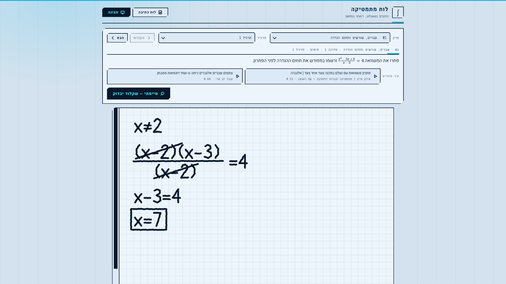
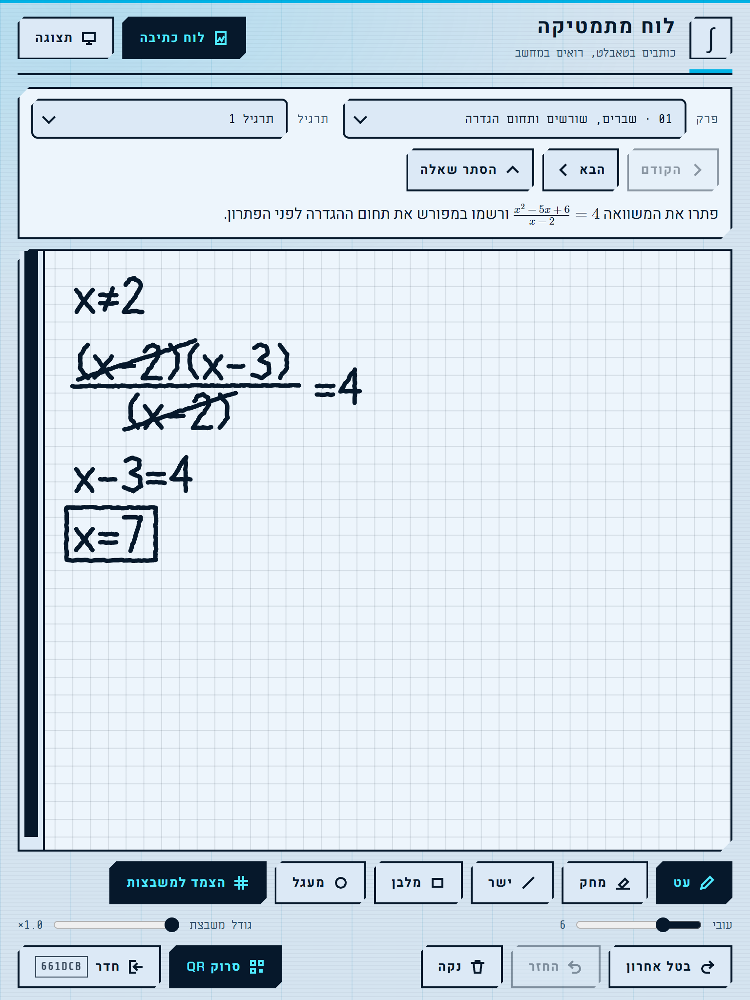

<div dir="rtl">

# בגרות 5 יח"ל במתמטיקה — לוח, חוברת, בוחן ומחקר

פרויקט לימוד לבגרות ב‑5 יחידות מתמטיקה, לפי התוכנית החדשה (שאלונים **35571** ו‑**35572**).
כותבים פתרון ביד בטאבלט, והמחשב שולח אותו ל‑Claude יחד עם התרגיל ועם הדרישות שבוחן בגרות
בודק לפיהן — דרישות שלכל אחת מהן יש מקור. סביב זה: חוברת תרגול של תרגילים מקוריים בעשרה
נושאים, ומסמך מחקר על הבחינה ועל השיטה.

נכתב על ידי **אבי** ([avi12.com](https://avi12.com)).

> ⚠️ פרויקט אישי, לא חומר רשמי. כללי הבחינה משתנים — הנתון המחייב הוא תמיד מה שמודפס על
> השאלון ובחוזר העדכני של משרד החינוך.

## איך זה נראה

המחשב, ב‑1080p: התרגיל מהחוברת, סרטוני "איך פותרים", כפתור הבדיקה, והלוח שמשקף את הטאבלט בזמן אמת.

<picture>
  <source media="(prefers-color-scheme: dark)" srcset="docs/screenshots/desktop-dark.png">
  
</picture>

הטאבלט, שעליו כותבים בעט — אותו תרגיל, עם כלי הציור.

<picture>
  <source media="(prefers-color-scheme: dark)" srcset="docs/screenshots/tablet-dark.png">
  
</picture>

## ארבעה חלקים, מאגר אחד

| החלק | איפה | מה הוא עושה |
|---|---|---|
| **אפליקציית הרשת** | [`apps/web`](apps/web) | לוח כתיבה בעט (Svelte 5 + Firebase): לחץ, מחק, צורות שנצמדות למשבצות, רצועה אין־סופית, סנכרון חי בין טאבלט למחשב, ובחירת תרגיל מהחוברת |
| **אפליקציית האנדרואיד** | [`apps/android`](apps/android) | עטיפת WebView לטאבלט: כפתור העט של S Pen, דארק מוד של המערכת, שיתוף, וקישור QR שנפתח בתוך החדר |
| **תוסף הכרום** | [`apps/extension`](apps/extension) | לוקח את הלוח ואת התרגיל מהדף ופותח איתם שיחה חדשה ב‑claude.ai — מדביק ולא שולח |
| **האינטגרציה עם Claude** | [`workbook`](workbook) ו‑[`video`](video) | הבוחן: פרומפט שבודק את **הדרך** ואוסר לדרוש דבר שאין לו מקור; הקריטריונים והתרגילים שמיוצאים ללוח; ותבנית לסרטון הסבר ב‑Manim עם קריינות ElevenLabs |

ומה שמשותף ליותר מחלק אחד יושב ב‑[`shared`](shared), פעם אחת:

| | מי קורא |
|---|---|
| `protocol.ts` — ההודעה בין הלוח לתוסף והמטען שלה | הלוח, התוסף, בדיקת השרשרת |
| `env.mjs` / `env.py` — קובץ ה‑`.env` היחיד, וכתובת הלוח שנגזרת ממנו | בדיקות הלוח, בניית התוסף, סקריפטי הפריסה (ואנדרואיד בכמה שורות משלו) |
| `skin/` — העיצוב: הגיליון, הצמד העברי והגופנים | הלוח (import) ודפי החוברת (`skin.py`) |
| `eslint-rules/`, ‏`.oxlintrc.json`, ‏`eslint.config.js`, ‏`.stylelintrc.json` (בשורש) | כל קוד ה‑TS וה‑Svelte |

## מה יש בחוברת

- **[`RESEARCH.md`](RESEARCH.md)** — המחקר: מבנה הבחינות ומשכן, המקורות הרשמיים, הבחינה
  המותאמת של תשפ"ז, איך כותבים תרגיל "בהשראת" שאלת בגרות בלי להעתיק אותה, הבדיקות
  האוטומטיות ומה כל אחת מהן לא רואה, והמלכודות של עברית + KaTeX.
- **עשרה נושאים של 35571.** בכל נושא: "למה" (אינטואיציה), "איך פותרים" (הפרוצדורה, שנכתבה
  מתוך סרטון הסבר ולא הועתקה ממנו), סרטון, טבלת הכלים (מה בנוסחאון ומה בעל‑פה), ותשעה עד
  שלושה‑עשר תרגילים בשלוש מדרגות — כולם מקוריים ומאומתים ב‑sympy.
- **הבוחן** — `prompt_text()` ב‑[`workbook/build/rebuild.py`](workbook/build/rebuild.py).

## הרצה

הקוד לא מצביע על אף פרויקט Firebase — כל עותק מביא פרויקט משלו, וכל ההגדרות בקובץ אחד:

1. פרויקט ב‑[Firebase](https://console.firebase.google.com) עם **Web app** ומסד **Firestore**.
2. ```bash
   cp .env.example .env                                 # הגדרות ה‑Web app
   cp apps/web/.firebaserc.example apps/web/.firebaserc # מזהה הפרויקט, ל‑firebase CLI
   npm i
   ```

| | |
|---|---|
| הלוח, מקומית | `npm run dev -w apps/web` |
| בדיקה ובנייה | `npm run check` · `npm run build` |
| פריסה (אתר + חוקי המסד) | `npm run deploy` — דרך gcloud; החשבון מ‑`gcloud config get account` או `GCLOUD_ACCOUNT` |
| אנדרואיד | `npm run apk` · `npm run apk:install` (טאבלט ב‑USB) |
| התוסף | `npm run build -w apps/extension` ← טוענים לכרום את `apps/extension/.output/chrome-mv3` |
| לינט | `npm run lint` · `npm run stylelint` |

כתובת הלוח היא `https://<project-id>.web.app` כברירת מחדל; `PAD_ORIGIN` ב‑`.env` משנה אותה —
התוסף מאזין לה והעטיפה פותחת אותה.

### החוברת

צריך Python 3 עם `sympy`, ו‑`pdftotext` (poppler).

```bash
python workbook/build/fetch_sources.py    # השאלונים, הנוסחאון וכללי תשפ"ז — מהאתר הרשמי

cd workbook
cp pages/workbook.base.html pages/workbook.html
python build/verify9.py      # טענות מספריות מול sympy
python build/rebuild.py      # הסברים, תרגילים ופרומפטים
python build/skin.py         # העיצוב, מ‑shared/skin
python build/qsim.py --all   # מקוריות מול השאלונים
python build/dupcheck.py     # כפילויות
python build/onepage.py      # הכול לדף אחד: workbook/dist/hub571/index.html
python build/graders.py      # הקריטריונים והתרגילים → apps/web/src/lib/graders.json
```

### בדיקות הלוח

סקריפטים של Node שמריצים Chrome בלי ממשק דרך DevTools Protocol, ב‑`apps/web/tests`:

```bash
npx vite preview --port 4173                          # מתוך apps/web
chrome --headless=new --remote-debugging-port=9431 --user-data-dir=<תיקייה> about:blank
node apps/web/tests/gridcheck.mjs http://localhost:4173/ 9431
```

כל קובץ בודק דבר אחד, והכותרת שלו מסבירה מה ולמה. יומן ההחלטות והמדידות של הלוח —
[`apps/web/docs/devlog.md`](apps/web/docs/devlog.md).

## מה לא נמצא במאגר, ולמה

| | |
|---|---|
| שאלוני הבגרות, הנוסחאון וכללי תשפ"ז | של משרד החינוך — הרישיון של הפרויקט לא יכול לחול עליהם. `fetch_sources.py` מוריד אותם מהמקור |
| שאלות בגרות אמיתיות | כל תרגיל כאן מסונתז. "בהשראת" — כן; אותו שלד בסיפור אחר — לא. ראו `RESEARCH.md` |
| `.env` וכל הגדרה של פריסה | של מי שמריץ |
| קריינות וסרטונים מרונדרים | פלט, לא מקור. מפיקים מחדש לפי `video/README.md` |

## רישיון

[GPL-3.0-or-later](LICENSE). © אבי ([avi12.com](https://avi12.com)).

רכיבים של צד שלישי שומרים על הרישיון שלהם: KaTeX והגופנים שלו ו‑Temml (MIT), והגופן Latin
Modern Math (GUST Font License). הסרטונים שהדפים מקשרים אליהם שייכים ליוצרים שלהם.

</div>
